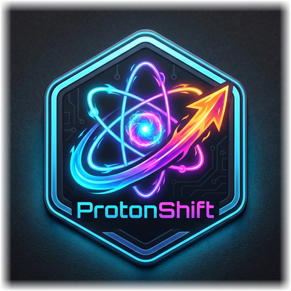

<p align="center">
  
</p>

<h1 align="center">ProtonShift</h1>

<p align="center">
  Linux game configuration toolkit. Everything you need, in one place.<br>
  No terminal gymnastics required.
</p>

<p align="center">
  <a href="#features">Features</a> &middot;
  <a href="#installation">Installation</a> &middot;
  <a href="#architecture">Architecture</a> &middot;
  <a href="#python-api">Python API</a> &middot;
  <a href="#license">License</a>
</p>

---

## Features

### Your Entire Library, Unified

ProtonShift pulls games from **Steam**, **Heroic** (Epic + GOG), and **Lutris** into a single searchable list. Source badges tell you where each game lives, and per-source counts keep things at a glance.

- Steam library discovery via `libraryfolders.vdf` + appmanifest files (native & Flatpak)
- Heroic discovery via Legendary JSON + GOG install info (native & Flatpak)
- Lutris discovery via `pga.db` + YAML prefix detection (native & Flatpak)
- Search across all sources at once
- Launch games directly: `steam://rungameid/` or `heroic://launch/`
- Copy App ID to clipboard in one click
- Open install folder or Wine prefix in your file manager

### Launch Options

Edit per-game launch options with a proper text editor, not a tiny Steam dialog box.

**Quick presets** let you toggle common snippets without memorizing them:

| Preset | What it does |
|--------|-------------|
| GameMode | Prepend `gamemoderun` for Feral GameMode |
| NVIDIA dGPU | Add offload env vars for hybrid GPU laptops |
| MangoHud | Enable the MangoHud overlay |
| Proton Log | Turn on `PROTON_LOG=1` for debugging |

Presets detect whether their tool is installed and grey out with a hint if it's missing.
Works for both **Steam** and **Heroic** games.

### Proton & Wine Tool Selection

Pick your compatibility layer from a dropdown instead of hunting through config files.

- **Steam:** Lists all installed Proton versions from `compatibilitytools.d` and built-in tools
- **Heroic:** Scans `tools/wine` and `tools/proton` directories, shows current selection

### Heroic Power User Toggles

For Heroic games, flip switches for the settings that usually mean editing JSON by hand:

- Esync / Fsync
- DXVK / VKD3D auto-install
- MangoHud overlay
- Feral GameMode
- NVIDIA Prime render offload

Changes persist immediately to Heroic's per-game config.

### Gamescope Command Builder

Build a complete Gamescope command visually. No man page required.

- Output and game resolution pickers with quick buttons (720p, 1080p, 1440p, 4K)
- FPS limiter
- FSR upscaling toggle with sharpness slider
- Integer scaling, HDR, fullscreen, borderless toggles
- Live preview of the generated command
- One click to insert it into your launch options or copy to clipboard
- Install hints for Ubuntu, Fedora, Arch if Gamescope isn't found

Available for Steam and Heroic games.

### MangoHud Config Editor

A full visual editor for MangoHud — no more hand-editing `.conf` files.

**Global config** (`~/.config/MangoHud/MangoHud.conf`):
- Toggle individual metrics on/off grouped by category: Performance, CPU, GPU, Memory, I/O, System, Behavior
- Set values: FPS limit, overlay position (8 anchor points), font size, background alpha
- Configure toggle hotkey with quick presets
- Set log folder with path presets and folder opener

**Per-game configs** (`wine-{game}.conf`):
- Auto-discovers existing per-game configs
- Deep-link from any game's detail page to its MangoHud config
- Create new per-game overrides

**Presets** to get started fast:
Minimal, FPS Only, Standard, CPU+GPU, Benchmark, Battery Saver, Streaming, Full, Debug

### Environment Variables

Manage global gaming environment variables that persist across reboots via `~/.config/environment.d/`.

**Built-in presets:**
- Proton NVIDIA / AMD optimizations
- DXVK / VKD3D tuning
- Shader cache settings
- Wayland compatibility
- GameMode integration
- Proton debug flags

Each preset shows exactly which variables it sets with descriptions, so you know what you're enabling.

### Configuration Profiles

Save a complete game setup as a named profile and restore it later — or apply it to a different game.

A profile captures:
- Launch options
- Compatibility tool / Wine version
- Current environment variables
- Active power profile

Profiles auto-highlight when they match the current game name or App ID. Loading a profile can optionally restore environment variables and power profile system-wide.

### Wine/Proton Prefix Management

See what's inside your Wine prefixes without digging through directories:

- Prefix size and creation date
- Detected DXVK version (from `d3d11.dll`)
- Detected VKD3D-Proton version (from `d3d12.dll`)
- Delete prefix with confirmation dialog
- Open prefix folder in file manager

Works for Steam, Heroic, and Lutris games (anywhere a prefix path is known).

### Shader Cache

Keep tabs on Steam's shader cache:

- Per-game cache size with a visual meter (scaled against 5 GB)
- Clear a single game's cache with confirmation
- Total shader cache size on the System page

### Game Save Backup & Restore

Never lose a save file again.

- Auto-detects save locations in Proton prefixes and Steam `userdata`
- Shows per-directory save sizes
- **Backup All** creates a timestamped ZIP archive under `~/.config/protonshift/backups/`
- Browse previous backups and restore with one click
- Works for Steam, Heroic, and Lutris games with known prefix paths

### Game-Specific Fixes Database

A built-in database of known fixes for common game issues.

- Fixes matched per App ID plus universal fixes that apply to all games
- Each fix can add environment variables, launch arguments, or both
- **One-click apply** merges the fix into your launch options
- User-contributed fixes can be added under `~/.config/protonshift/fixes/`

### Protontricks

Run Protontricks without leaving the app:

- Open the Protontricks GUI for any Steam game
- Quick-run common verbs: vcrun2022, dotnet48, d3dx9, corefonts, and more
- Supports both native and Flatpak installations of Protontricks

### System Info & Controls

The System page gives you a dashboard for your hardware:

**GPU:**
- Detection for NVIDIA (via `nvidia-smi`) and AMD/Intel (via DRM sysfs)
- Live temperature reading
- VRAM usage (NVIDIA)

**Power Profiles:**
- Switch between performance / balanced / battery saver
- Supports `system76-power` (Pop!_OS) and `powerprofilesctl` (generic)

**Displays:**
- Monitor detection via `xrandr` (X11) or `wlr-randr` (Wayland)
- Resolution and refresh rate per monitor

**Quick Actions:**
- Open MangoHud config folder
- Open ProtonShift config directory
- View total shader cache size

### Controllers

Detect connected game controllers and get the info you need:

- Auto-detect Xbox, PlayStation, Nintendo, and generic controllers from `/proc/bus/input`
- Show controller name and type with vendor identification
- Generate `SDL_GAMECONTROLLERCONFIG` mapping strings
- Copy mappings for use in Steam Input or as environment variables

### Theming

Multiple visual themes with light and dark variants, switchable from the nav bar. The theme persists across sessions.

---

## Installation

**Target:** Pop!_OS, Ubuntu 22.04+, Linux Mint, elementary OS.

Grab the latest **AppImage** or **.deb** from the [Releases](https://github.com/I4cTime/protonshift/releases) page.

### AppImage

```bash
chmod +x ProtonShift-*.AppImage
./ProtonShift-*.AppImage
```

### .deb

```bash
sudo dpkg -i ProtonShift-*.deb
```

Requires Python 3.12+ (included as a dependency in the .deb).

---

## Architecture

```
┌─────────────────────────────────────┐
│  Electron / Next.js UI              │
│  (React 19 + Tailwind + HeroUI v3) │
└──────────┬──────────────────────────┘
           │ IPC (preload bridge)
┌──────────▼──────────────────────────┐
│  Electron Main Process              │
│  (spawns Python, proxies requests)  │
└──────────┬──────────────────────────┘
           │ HTTP localhost
┌──────────▼──────────────────────────┐
│  Python FastAPI Backend             │
│  steam.py │ gpu.py │ vdf_config.py  │
│  heroic.py│lutris.py│profiles.py    │
└─────────────────────────────────────┘
```

---

## Python API

Both the UI and the backend share the same Python FastAPI server. The Electron app spawns it automatically, but you can also run it standalone:

```bash
pip install -e .
protonshift-api --port 8000
```

Endpoints: `/games`, `/env-vars`, `/system`, `/profiles`, `/presets`, and more.

---

## What's Next

A few things that are wired up on the backend but not yet exposed in the UI:

- Shader env var toggles (RADV_PERFTEST, MESA_SHADER_CACHE_DISABLE)
- Auto-backup saves before prefix deletion
- Per-game display/monitor targeting
- Per-game controller overrides
- User-defined fix creation screen
- Resolution switching from the System page

---

## License

[AGPL-3.0](LICENSE)
