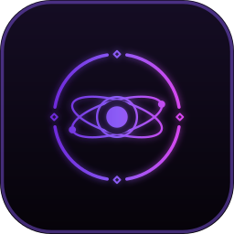

<p align="center">
  
</p>

<h1 align="center">ProtonShift</h1>

<p align="center">
  <b>The Linux game configuration toolkit.</b><br>
  Steam, Heroic and Lutris in one library. Gamescope, MangoHud and ScopeBuddy<br>
  in one editor. One native desktop app. No terminal gymnastics, no JSON spelunking.
</p>

<p align="center">
  <a href="https://github.com/I4cTime/protonshift/actions/workflows/ci.yml"></a>
  <a href="https://github.com/I4cTime/protonshift/releases/latest"></a>
  <a href="LICENSE"></a>
  
  <a href="https://protonshift.i4c.studio"></a>
  <a href="https://discord.gg/5uEApw5uEz"></a>
</p>

<p align="center">
  <a href="#why-protonshift">Why</a> &middot;
  <a href="#install">Install</a> &middot;
  <a href="#features">Features</a> &middot;
  <a href="ARCHITECTURE.md">Architecture</a> &middot;
  <a href="#development">Development</a> &middot;
  <a href="#license">License</a> &middot;
  <a href="https://protonshift.i4c.studio">Website</a>
</p>

---

## Why ProtonShift?

Linux gaming finally works. The configuration around it still doesn't.

You end up with launch options in Steam, Heroic JSON files for the same game
in another launcher, `MangoHud.conf` hand-edited in `nano`, `gamescope` flags
pasted from a Reddit comment, `scb.conf` for ScopeBuddy, `environment.d/*.conf`
for system-wide tuning, and a `~/.steam/steam/steamapps/compatdata/<appid>`
folder you're afraid to touch.

ProtonShift gathers all of that into one place: a native Linux desktop app —
**Qt Quick (QML)** UI driven from **Python via PySide6**, no Electron, no
bundled browser, no backend server to run or secure — that gives every one of
those tools a sensible UI.

## Install

There's no packaged release yet. The [Flatpak local build](flatpak/README.md)
is the current supported path, and a Flathub submission is in prep (see
[`flatpak/flathub/`](flatpak/flathub/)).

```bash
flatpak install -y flathub org.flatpak.Builder org.freedesktop.Sdk//24.08

flatpak run org.flatpak.Builder --user --install --force-clean \
  build-dir flatpak/io.github.i4ctime.protonshift.yml

flatpak run io.github.i4ctime.protonshift
```

Tagged GitHub releases also attach a prebuilt `.flatpak` bundle — see
[Releases](https://github.com/I4cTime/protonshift/releases). Full build
variants and options are in [flatpak/README.md](flatpak/README.md).

## Features

### Your entire library, unified

Pulls games from **Steam**, **Heroic** (Epic + GOG), and **Lutris** into one
searchable list, with per-source counts and one-click launch, install-folder,
and Wine-prefix access.

### Launch options, with quick presets

Edit per-game launch options directly, or toggle common snippets without
memorizing them: GameMode, force-NVIDIA-dGPU offload, MangoHud, Proton debug
logging, and a ScopeBuddy wrapper. Each preset greys out with an install hint
if the underlying tool isn't found.

### Compatibility tool selection

Pick a Proton or Wine build from a dropdown — Steam's `compatibilitytools.d`
and built-in tools, or Heroic's `tools/wine` and `tools/proton` — instead of
hunting through config files.

### Heroic per-game toggles

Esync/Fsync, DXVK/VKD3D auto-install, MangoHud, GameMode, and NVIDIA Prime
offload for Heroic games, saved straight to Heroic's per-game config.

### Gamescope command builder

Build a full `gamescope` invocation visually: output/game resolution with
quick presets, FPS limit, FSR upscaling with sharpness, integer scaling, HDR,
and window mode, plus a free-text field for extra arguments — with a live
command preview to copy or paste into launch options. Can also emit a
ScopeBuddy override (`SCB_AUTO_*` env vars + `scb --`) instead of a raw
command.

### ScopeBuddy integration

A dedicated editor for [ScopeBuddy](https://github.com/HikariKnight/ScopeBuddy)'s
`scb.conf` — global config and per-app overrides under `scb.conf.d/`, plus
reusable environment-variable snippets. Comments and existing bash structure
in the file are preserved on write.

### MangoHud config editor

Visual editing for global (`~/.config/MangoHud/MangoHud.conf`) and per-game
(`wine-<game>.conf`) configs — metrics grouped by category, overlay position,
toggle hotkey, and log folder, with presets to get started fast.

### Environment variables

Manage environment variables persisted to
`~/.config/environment.d/70-protonshift.conf`, with presets for common
GPU/Proton/Wayland tuning.

### Wine/Proton prefixes, shader cache, and save backups

Per-game prefix size and detected DXVK/VKD3D-Proton versions with one-click
delete; per-game shader cache size with clear; and save-file backup/restore
via timestamped ZIPs.

### Configuration profiles

Save a game's launch options, compatibility tool, environment variables, and
power profile as a named profile, then reapply it later — to the same game or
a different one.

### Game-specific fixes database

A built-in, extensible database of known fixes (environment variables and/or
launch arguments) matched per App ID or applied universally, with one-click
apply. User-contributed fixes live under `~/.config/protonshift/fixes/`.

### Protontricks

Run Protontricks without leaving the app — open its GUI for a game, or
quick-run common verbs. Supports native and Flatpak Protontricks installs.

### System info & display management

GPU detection (NVIDIA via `nvidia-smi`, AMD/Intel via sysfs) with live temps,
power-profile switching (`system76-power`, `power-profiles-daemon`), and
per-monitor resolution/refresh-rate control over `xrandr`, `wlr-randr`, or
`kscreen-doctor`, depending on your session.

### Controllers, with a live gamepad tester

Detects connected controllers, generates an `SDL_GAMECONTROLLERCONFIG`
mapping string, and includes a live tester — every button and axis in real
time, plus a rumble test to confirm haptics before you launch a game.

### Theming

Six built-in palettes, switchable in-app, including a "system" option that
follows your OS light/dark preference. See
[ARCHITECTURE.md](ARCHITECTURE.md) for how the design-system tokens work.

## Development

```bash
./run.sh
```

First run creates a `.venv`, installs the app in editable mode (PySide6 +
`vdf`), and launches. Re-run any time — it re-syncs dependencies and is
near-instant once the venv is current. Or manually:

```bash
python3 -m venv .venv && . .venv/bin/activate
pip install -e ".[dev]"
python -m protonshift
```

```bash
ruff check protonshift
pytest
```

CI (`.github/workflows/ci.yml`) runs the same `ruff check` and `pytest`, plus
`pyside6-qmllint` over `protonshift/qml`, on Python 3.11 and 3.12.

See [ARCHITECTURE.md](ARCHITECTURE.md) for the project layout, the
PySide6/QML threading pattern, and the release process, and
[CLAUDE.md](CLAUDE.md) for contributor/agent conventions.

## License

[AGPL-3.0](LICENSE) — copyleft for the network era. If you ship a modified
version of ProtonShift (even as a hosted service), the source has to stay
open.
