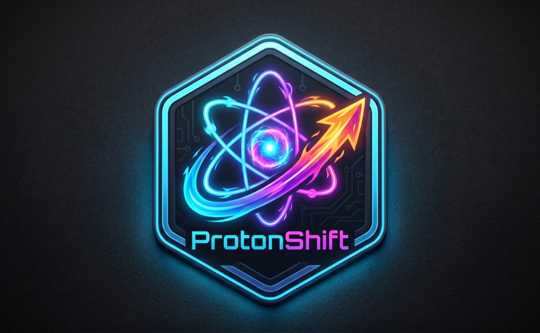

<p align="center">
  
</p>

<h1 align="center">ProtonShift</h1>

<p align="center">
  <b>The Linux game configuration toolkit.</b><br>
  Steam, Heroic and Lutris in one library. Gamescope, MangoHud and ScopeBuddy<br>
  in one editor. No terminal gymnastics. No JSON spelunking. No <code>winetricks</code> arcana.
</p>

<p align="center">
  <a href="https://github.com/I4cTime/protonshift/actions/workflows/ci.yml"></a>
  <a href="https://github.com/I4cTime/protonshift/releases/latest"></a>
  <a href="https://github.com/I4cTime/protonshift/releases"></a>
  <a href="LICENSE"></a>
  
</p>

<p align="center">
  <a href="#why-protonshift">Why</a> &middot;
  <a href="#install">Install</a> &middot;
  <a href="#features">Features</a> &middot;
  <a href="#roadmap">Roadmap</a> &middot;
  <a href="ARCHITECTURE.md">Contributing &amp; architecture</a> &middot;
  <a href="#license">License</a>
</p>

---

## Why ProtonShift?

Linux gaming finally works. The configuration around it still doesn't.

You end up with launch options in Steam, Heroic JSON files for the same game in another launcher, `MangoHud.conf` hand-edited in `nano`, `gamescope` flags pasted from a Reddit comment, `scb.conf` for ScopeBuddy, `environment.d/*.conf` for system-wide tuning, `protontricks` from a terminal, and a `~/.steam/steam/steamapps/compatdata/<appid>` folder you're afraid to touch.

ProtonShift gathers all of that into one place — a real desktop app, with a real backend — and gives every tool a sensible UI. Toggle DXVK and FSR with a switch. Build a Gamescope command with sliders. Hand-pick a MangoHud preset. Inspect a Wine prefix without `cd`-ing into it. Roll forward and back between configuration *profiles* per game.

---

## Install

Grab the latest **AppImage** from the [Releases](https://github.com/I4cTime/protonshift/releases) page. One binary, every distro — no package managers, no sandbox quirks.

```bash
chmod +x ProtonShift-*.AppImage
./ProtonShift-*.AppImage
```

Official builds bundle a portable **CPython 3.12** runtime *and* the full Python API stack (FastAPI, Uvicorn, VDF, etc.) beside the app. The only outside dependencies are the **game tools you actually want to manage** — Steam, Heroic, Lutris, MangoHud, Gamescope, ScopeBuddy, Protontricks, GameMode. No `python3-pydantic` on the host. Nothing leaking into your user site-packages.

Press <kbd>Ctrl</kbd>+<kbd>K</kbd> anywhere in the app to jump between pages or focus the game search.

---

## Features

### Your entire library, unified

ProtonShift pulls games from **Steam**, **Heroic** (Epic + GOG), and **Lutris** into a single searchable list. Source badges tell you where each game lives, per-source counts keep things at a glance.

- Steam discovery via `libraryfolders.vdf` + appmanifests (native & Flatpak)
- Heroic discovery via Legendary JSON + GOG install info (native & Flatpak)
- Lutris discovery via `pga.db` + YAML prefix detection (native & Flatpak)
- Search across all sources at once
- Launch directly with `steam://rungameid/` or `heroic://launch/`
- Copy App ID, open install folder, open Wine prefix — one click each

### Launch options, properly

Edit per-game launch options with a real text editor instead of Steam's matchbox dialog.

**Quick presets** let you toggle common snippets without memorising them:

| Preset | What it does |
|---|---|
| GameMode | Prepend `gamemoderun` for Feral GameMode |
| NVIDIA dGPU | Add offload env vars for hybrid GPU laptops |
| MangoHud | Enable the MangoHud overlay |
| Proton Log | Turn on `PROTON_LOG=1` for debugging |

Presets detect whether their tool is installed and grey out with a hint if it's missing. Works for **Steam** and **Heroic** games.

### Proton & Wine tool selection

Pick your compatibility layer from a dropdown instead of hunting through config files.

- **Steam:** lists all installed Proton versions from `compatibilitytools.d` and the built-in tools
- **Heroic:** scans `tools/wine` and `tools/proton`, shows the current selection

### Heroic power-user toggles

For Heroic games, flip switches for the settings that usually mean editing JSON by hand:

- Esync / Fsync
- DXVK / VKD3D auto-install
- MangoHud overlay
- Feral GameMode
- NVIDIA Prime render offload

Changes persist immediately to Heroic's per-game config.

### Gamescope command builder

Build a complete Gamescope command visually. No man page required.

- Output and game resolution pickers with quick buttons (720p, 1080p, 1440p, 4K)
- FPS limiter
- FSR upscaling toggle with sharpness slider
- Integer scaling, HDR, fullscreen, borderless toggles
- Live preview of the generated command
- One click to insert it into your launch options or copy to clipboard
- Install hints for Ubuntu, Fedora, Arch if Gamescope isn't found

When a [ScopeBuddy](#scopebuddy-integration-new-in-v095) override exists for the game, the builder picks it up and offers to round-trip back into ScopeBuddy.

### ScopeBuddy integration <a id="scopebuddy-integration-new-in-v095"></a> *(new in v0.9.5)*

[ScopeBuddy](https://github.com/HikariKnight/ScopeBuddy) is a brilliant little wrapper that intercepts `gamescope` invocations and lets you layer arguments per-application. ProtonShift now ships a first-class editor for it under **ScopeBuddy** in the nav.

- Inspect the global `scb.conf` and its environment variables side-by-side
- KV editor for `SCB_GAMESCOPE_ARGS`, `SCB_AUTO_RES`, `SCB_AUTO_HDR`, `SCB_AUTO_VRR`, `SCB_AUTO_REFRESH`, `SCB_AUTO_FRAME_LIMIT`, `SCB_NOSCOPE`, `SCB_NESTEDFIX`, `SCB_APPENDMODE`, `SCB_DEBUG`
- Per-app overrides under `scb.conf.d/` — create, edit, duplicate, delete
- Detection toasts: ProtonShift tells you when ScopeBuddy is installed, missing, or shadowed by an older fork
- Install hints for Bazzite/SteamOS, Fedora (Terra), Arch (AUR), NixOS, and a `curl` fallback
- Game detail page has a **ScopeBuddy override** card that deep-links straight to the right `scb.conf.d/<appid>.conf`

### MangoHud config editor

A full visual editor for MangoHud — no more hand-editing `.conf` files.

**Global config** (`~/.config/MangoHud/MangoHud.conf`):
- Toggle individual metrics grouped by category: Performance, CPU, GPU, Memory, I/O, System, Behavior
- Set values: FPS limit, overlay position (8 anchor points), font size, background alpha
- Configure the toggle hotkey with quick presets
- Set the log folder with path presets and a folder opener

**Per-game configs** (`wine-<game>.conf`):
- Auto-discovers existing per-game configs
- Deep-link from any game's detail page to its MangoHud config
- Create new per-game overrides

**Presets to get started fast:** Minimal · FPS Only · Standard · CPU+GPU · Benchmark · Battery Saver · Streaming · Full · Debug.

### Environment variables

Manage global gaming environment variables that persist across reboots via `~/.config/environment.d/`.

**Built-in presets:**
- Proton NVIDIA / AMD optimisations
- DXVK / VKD3D tuning
- Shader cache settings
- Wayland compatibility
- GameMode integration
- Proton debug flags

Each preset shows exactly which variables it sets with descriptions, so you know what you're enabling.

### Configuration profiles

Save a complete game setup as a named profile and restore it later — or apply it to a different game.

A profile captures:
- Launch options
- Compatibility tool / Wine version
- Current environment variables
- Active power profile

Profiles auto-highlight when they match the current game name or App ID. Loading a profile can optionally restore environment variables and the power profile system-wide.

### Wine / Proton prefix management

See what's inside your Wine prefixes without digging through directories:

- Prefix size and creation date
- Detected DXVK version (from `d3d11.dll`)
- Detected VKD3D-Proton version (from `d3d12.dll`)
- Delete prefix with confirmation dialog
- Open prefix folder in your file manager

Works for Steam, Heroic, and Lutris games — anywhere a prefix path is known.

### Shader cache

Keep tabs on Steam's shader cache:

- Per-game cache size with a visual meter (scaled against 5 GB)
- Clear a single game's cache with confirmation
- Total shader cache size on the System page

### Save backup & restore

Never lose a save file again.

- Auto-detects save locations in Proton prefixes and Steam `userdata`
- Shows per-directory save sizes
- **Backup All** creates a timestamped ZIP under `~/.config/protonshift/backups/`
- Browse previous backups and restore with one click
- Works for Steam, Heroic, and Lutris where a prefix path is known

### Game-specific fixes database

A built-in database of known fixes for common game issues.

- Fixes matched per App ID plus universal fixes that apply to all games
- Each fix can add environment variables, launch arguments, or both
- **One-click apply** merges the fix into your launch options
- User-contributed fixes can be added under `~/.config/protonshift/fixes/`

### Protontricks

Run Protontricks without leaving the app:

- Open the Protontricks GUI for any Steam game
- Quick-run common verbs: `vcrun2022`, `dotnet48`, `d3dx9`, `corefonts`, and more
- Supports native **and** Flatpak installations of Protontricks

### System info & controls

The System page is a dashboard for your hardware:

**GPU** — NVIDIA detection via `nvidia-smi`, AMD/Intel via DRM sysfs, live temps, VRAM usage (NVIDIA).
**Power profiles** — switch between performance / balanced / battery saver. Supports `system76-power` (Pop!_OS) and `powerprofilesctl` (generic).
**Displays** — monitor detection via `xrandr` (X11) or `wlr-randr` (Wayland), resolution and refresh rate per monitor.
**Quick actions** — open MangoHud config folder, open ProtonShift config directory, view total shader cache size.

### Controllers — with a live gamepad tester *(tester new in v0.9.5)*

Detect connected game controllers and get the info you need.

- Auto-detect Xbox, PlayStation, Nintendo, and generic controllers from `/proc/bus/input`
- Show controller name and type with vendor identification
- Generate `SDL_GAMECONTROLLERCONFIG` mapping strings
- Copy mappings for use in Steam Input or as environment variables
- **Live gamepad tester** — every button, every axis, every trigger, real-time. Buttons light up, axes turn into meters, deadzones are obvious, and a rumble test confirms haptics work before you fire up the game

### Command palette *(new in v0.9.5)*

Press <kbd>Ctrl</kbd>+<kbd>K</kbd> anywhere to jump between pages, focus the game search, or trigger common actions. Built on HeroUI Pro's `Command`. Closes on <kbd>Esc</kbd>.

### Theming

Multiple visual themes with light and dark variants, switchable from the nav bar. The theme persists across sessions.

---

## Roadmap

A few things wired up on the backend but not yet surfaced in the UI, plus close-to-the-edge wishlist items:

- [ ] Shader env-var toggles (`RADV_PERFTEST`, `MESA_SHADER_CACHE_DISABLE`)
- [ ] Auto-backup saves before prefix deletion
- [ ] Per-game display / monitor targeting
- [ ] Per-game controller overrides (mapping presets per App ID)
- [ ] User-defined fix creation screen
- [ ] Resolution switching from the System page
- [ ] Lutris launch options editor parity with Steam/Heroic
- [ ] ScopeBuddy: bulk import/export of per-app overrides
- [ ] Flatpak permission inspector for sandboxed launchers

Have an idea? [Open an issue](https://github.com/I4cTime/protonshift/issues/new/choose).

---

## Contributing

PRs are welcome. The full contributor guide — architecture overview, project layout, build instructions, VM testing harness, pre-commit checks, and release process — lives in [**ARCHITECTURE.md**](ARCHITECTURE.md).

TL;DR:

```bash
# Backend
python3 -m venv .venv && source .venv/bin/activate
pip install -e ".[dev]"
pytest -q

# Renderer (needs HEROUI_AUTH_TOKEN for the private @heroui-pro/react package)
cd electron/renderer && pnpm install && pnpm dev

# Full Electron app
cd electron && pnpm install && pnpm dev
```

---

## License

[AGPL-3.0](LICENSE) — copyleft for the network era. If you ship a modified version of ProtonShift (even as a hosted service), the source has to stay open.
